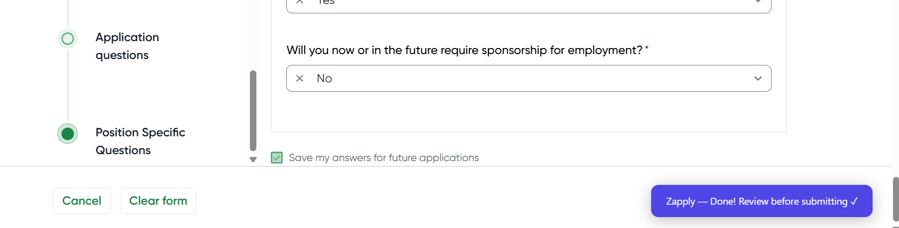
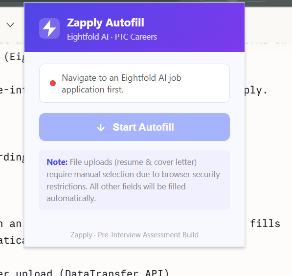

# Eightfold AI Autofill — Chrome Extension

A Chrome extension that automatically fills job application forms on 
PTC's careers website (Eightfold AI ATS platform).


## Demo



## What It Does

Detects when you're on an Eightfold AI application page, then fills 
all form fields automatically with one click:

- Resume & cover letter upload (DataTransfer API)
- Contact information
- Disability & veteran self-identification forms
- Address (with country dropdown — 200+ options)
- Salary expectations & remote work preference
- Work authorization & sponsorship status

**Field coverage: 100% of autofillable fields**

## Technical Highlights

### React-controlled input bypass
Standard `el.value = x` does nothing on React inputs — React stores 
state in its fiber tree. This extension uses the native 
`HTMLInputElement.prototype` value setter combined with `InputEvent` 
dispatch to properly trigger React's `onChange` handlers.

### Custom dropdown interaction
Eightfold's dropdowns are `<button role="option">` React components, 
not native `<select>` elements. The extension clicks the trigger, 
waits for options to become visible via `offsetParent` polling, then 
clicks the exact match.

### File upload via DataTransfer API
Fetches the resume URL, converts to `Blob`, wraps in a `File` object, 
constructs a real `FileList` via the `DataTransfer` API, and assigns 
it to `input.files` — identical to a native file dialog selection.

### Timing — polling over sleep()
Uses a `waitFor()` polling function instead of hardcoded `sleep()` 
delays. Resolves immediately when the DOM condition is true, with a 
hard timeout fallback.

## Installation

1. Clone this repo
2. Open Chrome → `chrome://extensions`
3. Enable **Developer mode** (top right)
4. Click **Load unpacked** → select the `autofill-extension` folder
5. Navigate to an Eightfold AI application page
6. Click the extension icon → **Start Autofill**

## Project Structure
```
autofill-extension/
├── manifest.json     # MV3 extension config
├── content.js        # Core autofill logic (injected into page)
├── background.js     # Service worker — message relay
├── popup.html        # Extension popup UI
└── popup.js          # Popup logic
```

## Stack

- Vanilla JavaScript (no frameworks)
- Chrome Extension APIs (Manifest V3)
- Chrome Runtime messaging
- DataTransfer API
- MutationObserver

## Author

Muhammad Umer Mehboob  
[linkedin.com/in/umermk12](https://linkedin.com/in/umermk12)